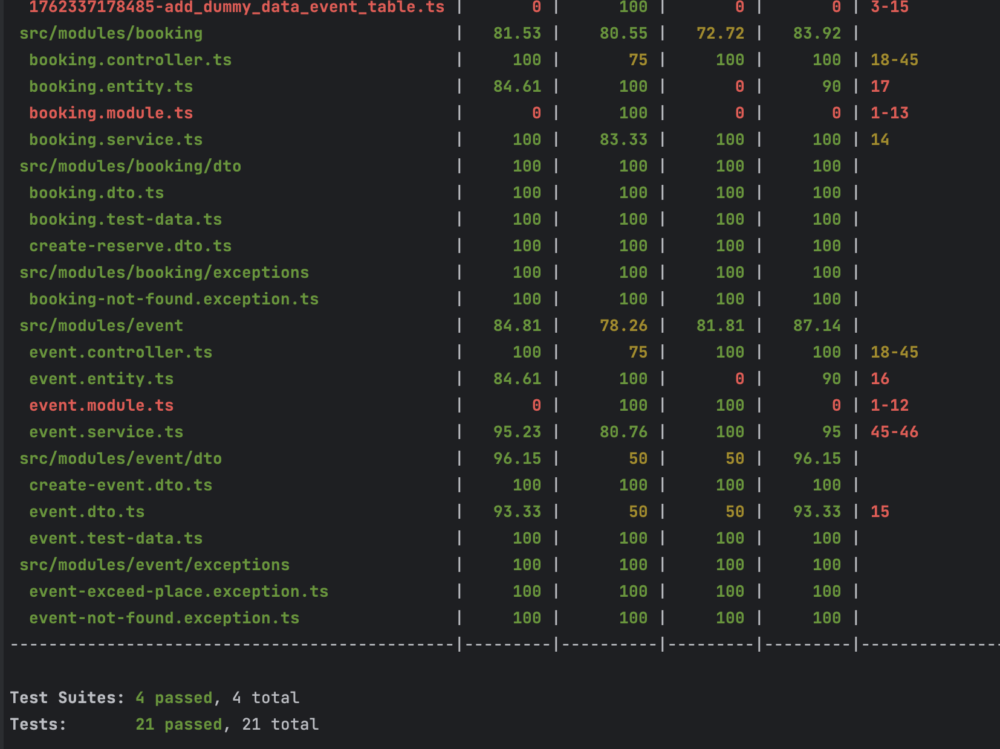
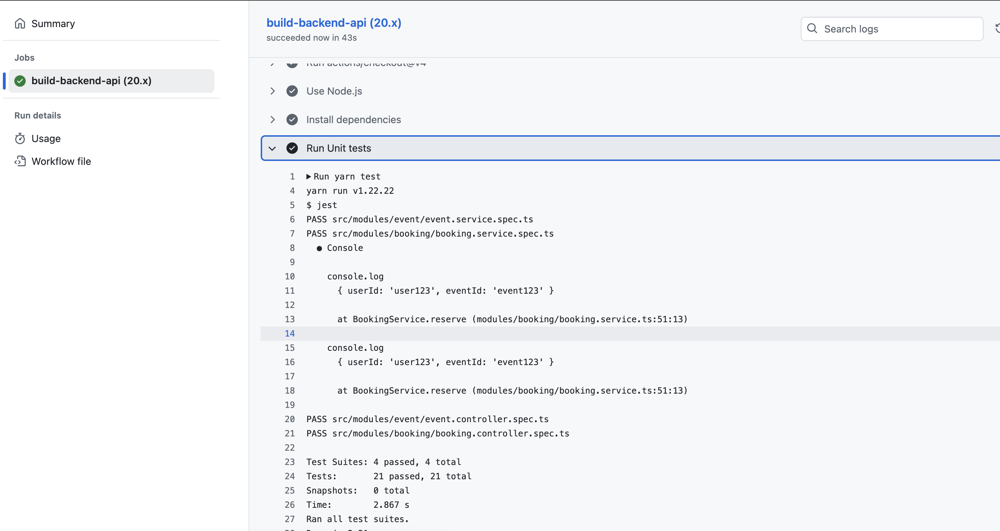

# Event Registration System


Stack:
- NodeJS 23v
- NestJS 11v
- PostgreSQL 15v
- TypeOrm


Для наглядности немного кастомизировал следущие вещи:
1. Использовал abstarct class для id и created_at полей
2. сделал трансформер toDto() c прототипированием объекта и декоратор
3. добавил кастомные декораторы для валидности с swagger и самим валидатором
4. Использовал contraint exception (src/filters/query-failed.filter.ts)
5. Добавио юнит тесты в CI

## Run project app

1. 
```
$ docker-compose up or with detach (docker-compose up -d)
```

2.
```
$ docker exec -it event-reservation-system-backend sh
```

3. 
```
$ yarn migration:run
```

or use Makefile

```
$ make run
```

4. 
go to [swagger](http://localhost:9000/swagger)


## Endpoints


All IDs (when add userId ) use UUID4 you can get it from https://www.uuidgenerator.net/

1. `http://localhost:9000/api/events/all`

Request
```
curl -X 'GET' \
  'http://localhost:9000/api/events/all' \
  -H 'accept: application/json'
```
Response
```
[
  {
    "id": "79bbf54e-ef0a-4b6a-981b-ad271de6e3f9",
    "createdAt": "2025-11-05T10:06:51.004Z",
    "name": "event_2",
    "totalSeats": 10,
    "booking": [
      {
        "id": "4241c83c-45b0-4581-9a3c-f36ffb59e11d",
        "createdAt": "2025-11-05T12:04:34.899Z",
        "userId": "296f31d6-8b81-408d-9bbc-4148512c0066",
        "eventId": "79bbf54e-ef0a-4b6a-981b-ad271de6e3f9"
      },
      {
        "id": "a903f6f2-6345-4e28-bd8c-46ded9f6e82b",
        "createdAt": "2025-11-05T12:15:10.024Z",
        "userId": "296f31d6-8b81-408d-9bbc-4148512c0060",
        "eventId": "79bbf54e-ef0a-4b6a-981b-ad271de6e3f9"
      },
      {
        "id": "0afa92f2-5186-4994-94bb-7dd5f700c55f",
        "createdAt": "2025-11-05T12:15:24.927Z",
        "userId": "296f31d6-8b81-408d-9bbc-4148512c0059",
        "eventId": "79bbf54e-ef0a-4b6a-981b-ad271de6e3f9"
      },
      {
        "id": "813bce22-9a70-4adb-b7c9-26ce6eed6bba",
        "createdAt": "2025-11-05T12:21:29.023Z",
        "userId": "296f31d6-8b81-408d-9bbc-4148512c0058",
        "eventId": "79bbf54e-ef0a-4b6a-981b-ad271de6e3f9"
      },
      {
        "id": "551bde8d-4970-47f3-ae81-3d47aa507999",
        "createdAt": "2025-11-05T12:21:46.887Z",
        "userId": "296f31d6-8b81-408d-9bbc-4148512c0018",
        "eventId": "79bbf54e-ef0a-4b6a-981b-ad271de6e3f9"
      }
    ],
    "count": 5
  },
  {
    "id": "e1b215f6-cde7-4e41-96dd-766dcc830e3d",
    "createdAt": "2025-11-05T10:53:46.304Z",
    "name": "test_5",
    "totalSeats": 9,
    "booking": [],
    "count": 0
  },
  {
    "id": "c00411d8-a5e4-4096-b91f-e2ccfd309dfd",
    "createdAt": "2025-11-05T10:06:51.004Z",
    "name": "event_3",
    "totalSeats": 7,
    "booking": [],
    "count": 0
  },
  {
    "id": "b11f4f68-ce12-48c7-afd8-52f48a4f44f4",
    "createdAt": "2025-11-05T10:06:51.004Z",
    "name": "event_1",
    "totalSeats": 5,
    "booking": [],
    "count": 0
  }
]

```

2. `http://localhost:9000/api/events/id`

Request
```
curl -X 'GET' \
  'http://localhost:9000/api/events/79bbf54e-ef0a-4b6a-981b-ad271de6e3f9' \
  -H 'accept: application/json'

```

Response
```
{
  "id": "79bbf54e-ef0a-4b6a-981b-ad271de6e3f9",
  "createdAt": "2025-11-05T10:06:51.004Z",
  "name": "event_2",
  "totalSeats": 10,
  "booking": [
    {
      "id": "4241c83c-45b0-4581-9a3c-f36ffb59e11d",
      "createdAt": "2025-11-05T12:04:34.899Z",
      "userId": "296f31d6-8b81-408d-9bbc-4148512c0066",
      "eventId": "79bbf54e-ef0a-4b6a-981b-ad271de6e3f9"
    },
    {
      "id": "a903f6f2-6345-4e28-bd8c-46ded9f6e82b",
      "createdAt": "2025-11-05T12:15:10.024Z",
      "userId": "296f31d6-8b81-408d-9bbc-4148512c0060",
      "eventId": "79bbf54e-ef0a-4b6a-981b-ad271de6e3f9"
    },
    {
      "id": "0afa92f2-5186-4994-94bb-7dd5f700c55f",
      "createdAt": "2025-11-05T12:15:24.927Z",
      "userId": "296f31d6-8b81-408d-9bbc-4148512c0059",
      "eventId": "79bbf54e-ef0a-4b6a-981b-ad271de6e3f9"
    },
    {
      "id": "813bce22-9a70-4adb-b7c9-26ce6eed6bba",
      "createdAt": "2025-11-05T12:21:29.023Z",
      "userId": "296f31d6-8b81-408d-9bbc-4148512c0058",
      "eventId": "79bbf54e-ef0a-4b6a-981b-ad271de6e3f9"
    },
    {
      "id": "551bde8d-4970-47f3-ae81-3d47aa507999",
      "createdAt": "2025-11-05T12:21:46.887Z",
      "userId": "296f31d6-8b81-408d-9bbc-4148512c0018",
      "eventId": "79bbf54e-ef0a-4b6a-981b-ad271de6e3f9"
    }
  ],
  "count": 5
}
```
3. `http://localhost:9000/api/events/create`

Request
```
curl -X 'POST' \
  'http://localhost:9000/api/events/create' \
  -H 'accept: application/json' \
  -H 'Content-Type: application/json' \
  -d '{
  "name": "1ds212",
  "totalSeats": 4
}'
```

Response

```
{
  "id": "4ff81b58-5ac1-4728-964b-d1b12bca362c",
  "createdAt": "2025-11-05T13:01:43.417Z",
  "name": "1ds212",
  "totalSeats": 4,
  "count": 0
}
```

Some exceptions

```
{
  "message": [
    "totalSeats must not be less than 1"
  ],
  "error": "Bad Request",
  "statusCode": 400
}
```

```
{
  "message": "error.eventExceedPlace",
  "error": "Bad Request",
  "statusCode": 400
}
```

4. `http://localhost:9000/api/bookings/reserve`

Request
```
curl -X 'POST' \
  'http://localhost:9000/api/bookings/reserve' \
  -H 'accept: application/json' \
  -H 'Content-Type: application/json' \
  -d '{
  "eventId": "4ff81b58-5ac1-4728-964b-d1b12bca362c",
  "userId": "3fa85f64-5717-4562-b3fc-2c963f66afa6"
}'

```

Response

```
{
  "id": "ff24c3ca-16a7-4136-ac40-eafec2a2405f",
  "createdAt": "2025-11-05T13:03:15.113Z",
  "eventId": "4ff81b58-5ac1-4728-964b-d1b12bca362c",
  "userId": "3fa85f64-5717-4562-b3fc-2c963f66afa6"
}
```
Some exceptions

Exception via postgre constraint
```
{
  "statusCode": 409,
  "error": "Conflict",
  "message": "error.reserveExists"
} 
```

Exception via service
```
{
  "message": "error.eventExceedPlace",
  "error": "Bad Request",
  "statusCode": 400
}
```
```
{
  "message": "error.bookingExceedPlace",
  "error": "Bad Request",
  "statusCode": 400
}
```
5. `http://localhost:9000/api/bookings/all`
6. http://localhost:9000/api/bookings/{id}` - id as UUID

Request
```
curl -X 'GET' \
  'http://localhost:9000/api/bookings/ff24c3ca-16a7-4136-ac40-eafec2a2405f' \
  -H 'accept: application/json'
```

Response

```
{
  "id": "ff24c3ca-16a7-4136-ac40-eafec2a2405f",
  "createdAt": "2025-11-05T13:03:15.113Z",
  "eventId": "4ff81b58-5ac1-4728-964b-d1b12bca362c",
  "userId": "3fa85f64-5717-4562-b3fc-2c963f66afa6"
}
```


## Database Migrations

```
Before access to container
$ make app_shell

# Migration run
$ yarn migration:run


# Revert last migration
$ yarn migration:revert

Or  use Make commands
```


## Project setup

```bash
$ pnpm install
```

## Compile and run the project

```bash
# development
$ pnpm run start

# watch mode
$ pnpm run start:dev

# production mode
$ pnpm run start:prod
```

## Tests

### Run tests

```bash
# unit tests
$ pnpm run test
[test](test)
# e2e tests
$ pnpm run test:e2e

# test coverage
$ pnpm run test:cov
```

Coverage tests






## Useful Makefile commands

Enter to docker app

```shell
make app_shell
```

Migrate DB

```shell
make db
```

Revert Last migration

```shell
make db-revert
```
